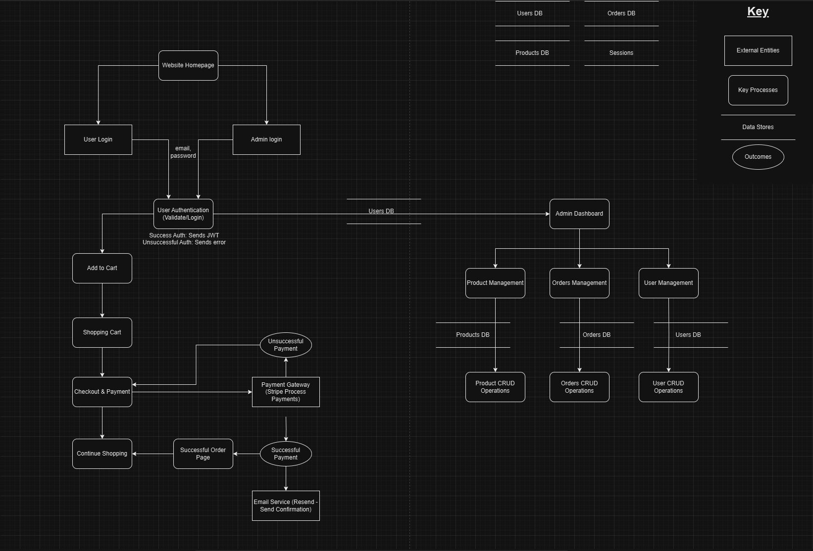
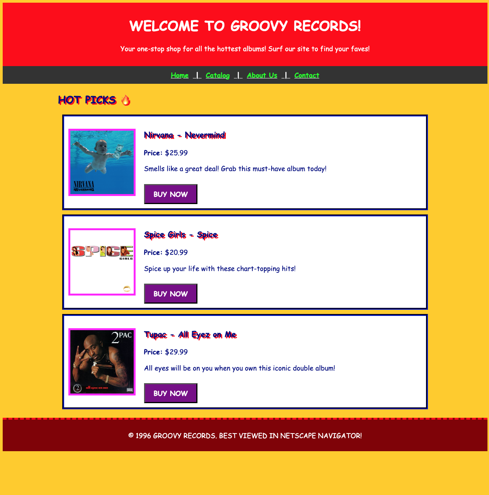
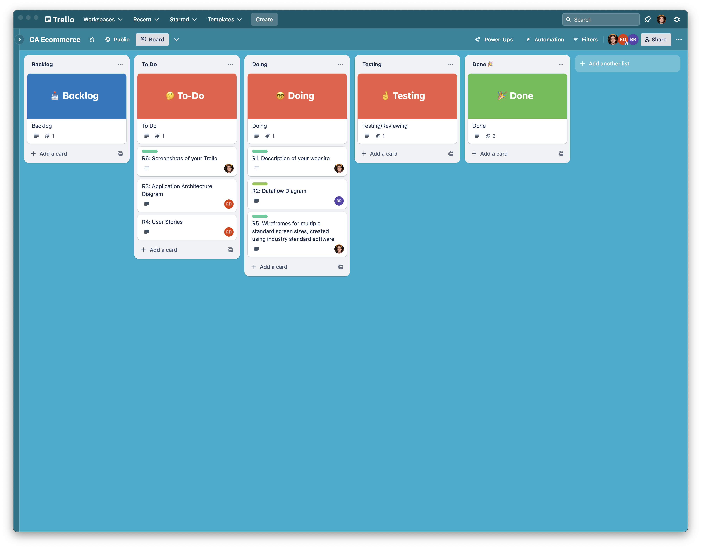
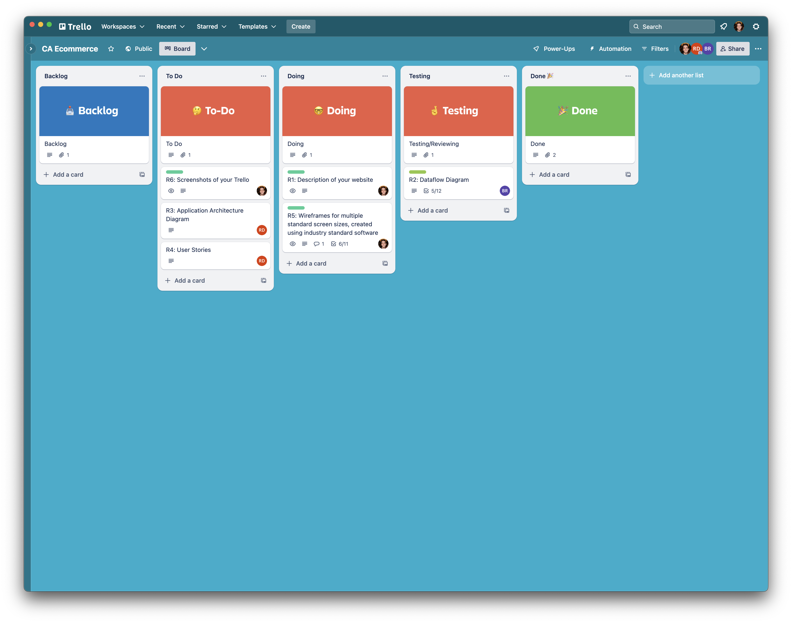
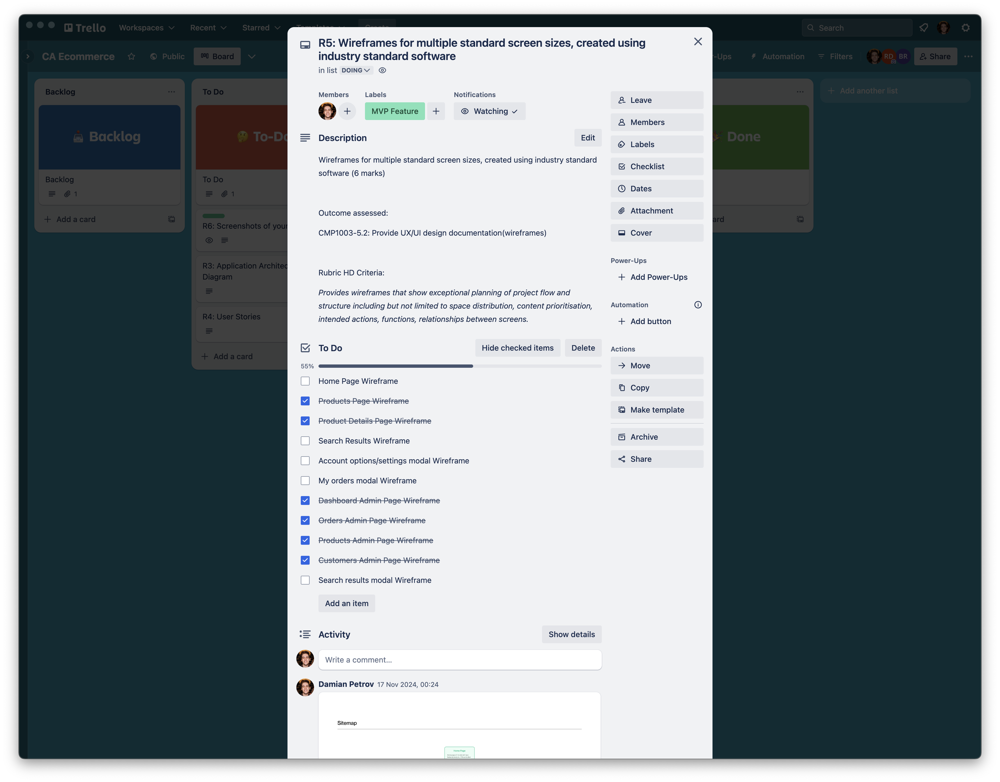
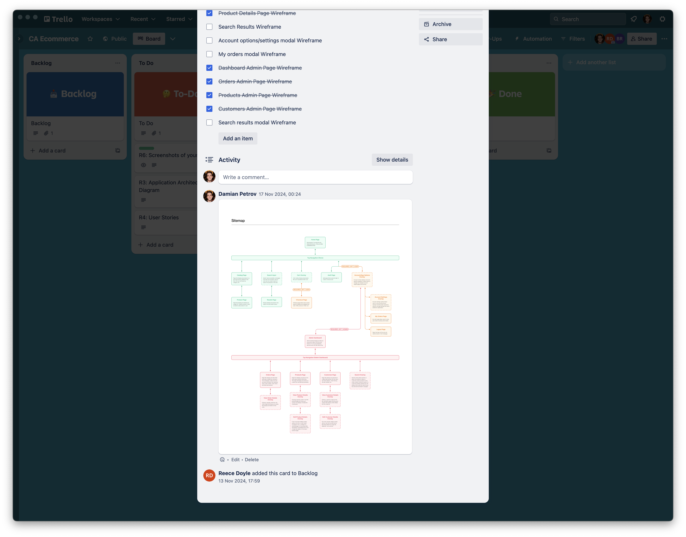
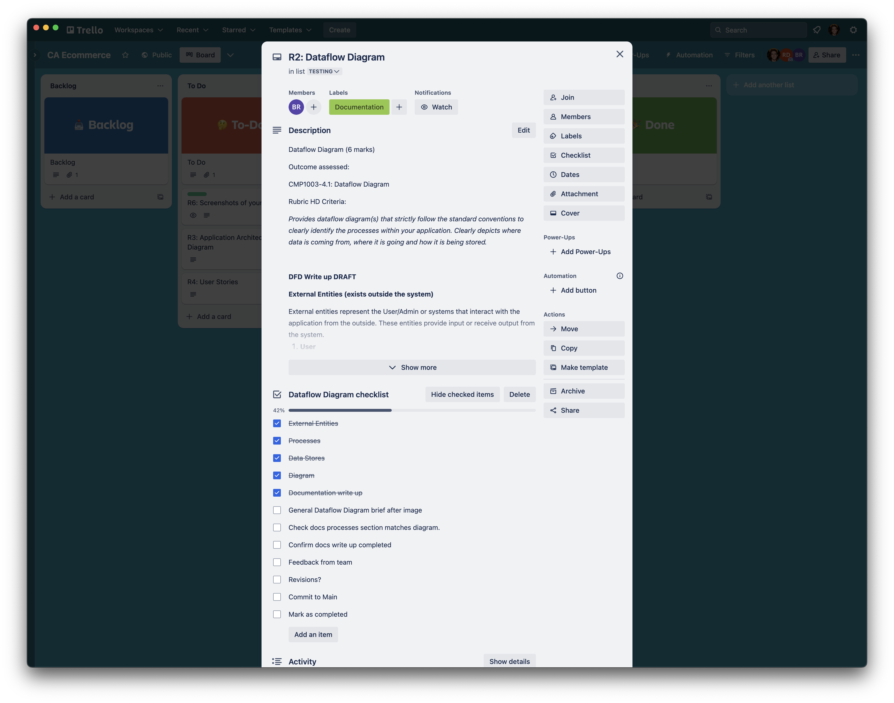

# Vinyl Vibe - T3A2-A

Vinyl Vibe is a sophisticated e-commerce store built using the MERN stack. This platform seamlessly integrates secure payment processing, user authentication, and inventory management into a user-friendly shopping experience.

At its core, the application serves as a bridge between businesses and their customers, offering a modern, responsive interface for browsing products, managing purchases, and processing secure transactions. Built with scalability in mind, it accommodates both small businesses and larger enterprises, providing essential tools for inventory management, order processing, and customer engagement.

The platform combines React's powerful frontend capabilities with Express.js's robust backend, MongoDB's flexible data management, and industry-standard security practices. With features like Stripe integration for payments and automated email notifications through Resend, it delivers a comprehensive solution for modern e-commerce needs.

Key aspects include:

-   Secure user authentication and authorization
-   Comprehensive product management system
-   Streamlined checkout process with Stripe integration
-   Responsive design for all devices
-   Admin dashboard for business operations
-   Real-time inventory tracking
-   Automated email notifications for orders and updates

 

## Table of Contents

-   [Features and Functionality](#features-and-functionality)

    -   [MVP Features](#mvp-features)
    -   [Additional Features](#additional-features-post-mvp)

 

-   [Packages, Dependencies and Third-Party Services](#packages-dependencies-and-third-party-services)

    -   [Backend](#backend)
    -   [Frontend](#frontend)
    -   [Development](#development)
    -   [Deployment Services](#deployment-services)

 

-   [Dataflow & Application Architecture](#dataflow-and-application-architecture)

    -   [Dataflow Diagram](#dataflow-diagram)
    -   [Application Architecture Diagram](#application-architecture-diagram)

 

-   [User Stories & Personas](#user-stories-and-personas)

    -   [Persona 1](#persona-1)
    -   [Persona 2](#persona-2)
    -   [Persona 3](#persona-3)
    -   [User Story 1](#user-story-1)
    -   [User Story 2](#user-story-2)
    -   [User Story 3](#user-story-3)

 

-   [Task Management and Project Progress](#task-management-and-project-progress)
    -   [Trello Board](#trello-board)
    -   [Key Milestones](#key-milestones)

 

## Features and Functionality

### MVP Features

1. **User Authentication and Management**

    - Secure registration and login system
    - JWT-based authentication
    - Password reset via email
    - User profile management
    - Role-based access (Customer/Admin)
    - Order history tracking
    - Address management

2. **Product Management**

    - Product catalog with detailed information
    - Multiple product images
    - Category organization
    - Search functionality
    - Stock level tracking
    - Product availability status
    - Basic sorting options

3. **Shopping Experience**

    - Intuitive shopping cart
    - Real-time stock updates
    - Mobile-responsive design
    - Product image galleries
    - Cart persistence
    - Guest checkout option
    - Basic product filtering

4. **Payment and Checkout**

    - Stripe payment integration
    - Secure checkout process
    - Order confirmation system
    - Email notifications
    - Basic shipping options
    - Order tracking
    - Transaction history

5. **Admin Features**
    - Product CRUD operations
    - Basic inventory management
    - Order processing system
    - Category management

### Additional Features (Post-MVP)

1. **Enhanced Shopping Features**

    - Product reviews and ratings
    - Wishlist functionality
    - Recently viewed products
    - Social sharing

2. **Advanced Commerce Features**

    - Multiple payment methods
    - Discount code system

3. **Advanced Admin Tools**
    - Advanced analytics
    - Bulk product management
    - Advanced user management
    - Sales reports
    - Customer insights
    - Staff accounts

Each feature is designed to enhance the overall shopping experience while providing businesses with powerful tools to manage their online presence effectively.

 
 

## Packages, Dependencies and Third-Party Services

The E-commerce Store utilises carefully selected technologies that work together to create a robust online shopping experience. Here's a detailed overview of our technology choices and why they're essential for our project:

### Backend

-   `Express.js` (version 4.18.2)
    -   body-parser
    -   cors
    -   compression
        We chose Express.js as our backend framework for its minimalist yet powerful approach. Its middleware system is perfect for our e-commerce needs, allowing us to easily implement authentication, request processing, and error handling. The large ecosystem of middleware packages helps us solve common e-commerce challenges like CORS for secure client-server communication and compression for faster response times.

 

-   `MongoDB` (version 6.3.0)

    -   mongodb (version 6.3.0)
    -   mongoose (version 8.1.1)

    MongoDB's flexible schema design is ideal for our e-commerce platform where product attributes can vary significantly. Mongoose adds a crucial layer of structure and validation, ensuring our product data, user profiles, and order information maintain consistency. The schema-based approach helps prevent errors in critical operations like order processing and inventory management.

 

-   `JSON Web Token` (version 9.0.2)

    -   jsonwebtoken

    JWT provides a secure and scalable solution for user authentication in our e-commerce platform. It enables stateless authentication, perfect for maintaining user sessions across multiple devices while accessing protected routes like user profiles, order history, and admin functions.

 

-   `Stripe` (version 14.14.0)

    For handling payments, Stripe is our go-to choice due to its robust security features and comprehensive API. It manages complex payment flows while ensuring PCI compliance, handling multiple currencies, and providing detailed transaction analytics - crucial features for any modern e-commerce platform.

 

-   `Resend` (version 3.2.0)

    Email communication is vital for e-commerce, and Resend provides a modern, developer-friendly solution. We use it for sending order confirmations, shipping updates, password resets, and marketing communications, with excellent delivery rates and easy-to-use templates.

 

-   `Jest` (version 29.7.0)

    -   supertest

    Testing is crucial for maintaining reliability in e-commerce systems. Jest provides a comprehensive testing solution for our backend, allowing us to verify critical paths like checkout processes, inventory updates, and user authentication flows with confidence.

 

### Frontend

-   `React` (version 18.2.0)

    -   react-dom
    -   react-router-dom (version 6.22.0)

    React forms the foundation of our frontend, chosen for its component-based architecture that perfectly suits our e-commerce UI needs. It enables us to create reusable components for product cards, shopping carts, and checkout forms while maintaining excellent performance through its virtual DOM system.

 

-   `Vite` (version 5.1.0)

    -   @vitejs/plugin-react

    Vite significantly improves our development workflow with its lightning-fast hot module replacement and optimised build process. This means faster development cycles and better performance for our customers, crucial for maintaining a competitive e-commerce platform.

 

-   `Tailwind CSS` (version 3.4.1)

    -   postcss
    -   autoprefixer

    Tailwind CSS enables us to build a consistent and responsive design system efficiently. Its utility-first approach allows rapid UI development while maintaining a professional look across our product catalog, shopping cart, and checkout process. The built-in responsive design utilities ensure our store looks great on all devices.

 

-   `shadcn/ui` (version 0.8.0)

    -   @radix-ui/react-\* (various components)
    -   class-variance-authority
    -   clsx
    -   tailwind-merge

    We leverage shadcn/ui to provide a consistent and accessible component library. Its integration with Tailwind CSS and focus on customization allows us to maintain brand consistency while providing a polished user experience across all interactive elements of our store.

 

-   `Vitest` (version 1.2.0)

    -   @testing-library/react
    -   @testing-library/jest-dom

    Vitest ensures our frontend components and user interactions work flawlessly. Its compatibility with Vite makes it perfect for testing critical user flows like add-to-cart functionality, checkout processes, and form validations in a way that mimics real user behaviour.

 

-   `Axios` (version 1.6.7)

    For handling API communications, Axios provides a robust solution with features like request/response interceptors and automatic JSON transformation. This is crucial for maintaining smooth communication between our frontend and backend, especially for operations like cart updates and order processing.

 

### Development

-   `nodemon` (version 3.0.3)

    During development, nodemon dramatically improves our workflow by automatically restarting the server when code changes are detected. This is particularly valuable when working on API endpoints and backend business logic, ensuring we can quickly test and iterate on features.

 

-   `dotenv` (version 16.4.1)

    Security is paramount in e-commerce, and dotenv helps us manage sensitive configuration data like API keys and database credentials safely across different environments. It's essential for maintaining secure configurations between development, testing, and production environments.

 

### Deployment Services

-   `Vercel`
    For our e-commerce frontend, Vercel is the ideal choice due to its seamless integration with React applications. Its zero-configuration deployment process means we can focus more on developing features rather than dealing with deployment complexities. The platform's edge network ensures our store loads quickly for customers worldwide, while the automatic preview deployments for each pull request enable our team to confidently review changes before they go live. The built-in analytics help us understand user behaviour and optimise the shopping experience.

 

-   `Render`

    We chose Render for our backend deployment because it strikes the perfect balance between simplicity and power for a Node.js/Express API. Unlike more complex platforms like AWS, Render allows us to deploy our API with minimal configuration while still providing enterprise-grade features. Its automatic scaling capabilities ensure our store can handle traffic spikes during peak shopping periods or sales events. The seamless integration with MongoDB Atlas and built-in SSL security makes it ideal for handling sensitive customer data and payment processing through Stripe.

 

-   `MongoDB Atlas`

    For an e-commerce platform that needs to handle dynamic product catalogs, user sessions, and order processing, MongoDB Atlas provides the flexibility and scalability we need. Its document-based structure perfectly matches our data models for products, users, and orders, while the ability to perform complex queries helps with features like product filtering and search. The automated backups and security features protect our customer data, while the global distribution ensures fast database access regardless of customer location. The built-in monitoring helps us optimise performance and identify potential issues before they impact the shopping experience.

 

These packages and their dependencies work together to provide a robust, secure, and efficient full-stack e-commerce application, handling everything from database operations and payment processing to user interface components and testing.

 

## Dataflow & Application Architecture

#### Dataflow Diagram brief goes here
- Small description

### External Entities

External entities represent the User/Admin or systems that interact with the application from the outside. These entities provide input or receive output from the system.

1. User
- Represents the customer interacting with the eCommerce store.
- Actions:
    - Authenticates to log in or register.
    - Browse products
    - Add items to shopping cart
    - Proceed to checkout
    - Payment

2. Admin
- Represents the store administrator who can manage the store and perform CRUD operations.
- Actions:
    - Manages Product, Orders and Users via CRUD operations.
    - View the admin dashboard tools

3. Payment Gateway (Stripe)
- Third party service used to securely process payments.
- Actions:
    - Processes payment details submitted by customer during checkout.
    - Returns a payment confirmation or failure status.

4. Email service (Resend)
- Third party email service used for sending transactional emails.
- Actions:
    - Sends order confirmation emails to the customer upon successful order payment.
    - Sends additional updates related to orders or account activities.

### Processes

Processes represent the core operations or functions that process, manipulate, or route data within the system.

1. User Authentication
- Validates user credentials during login or registration.
- Inputs: login credentials (email and password).
- Outputs: Authentication token (JWT) on success or error message on failure.

2. Product Management (Admin)
- Manages the product inventory.
- Inputs: Admin provided product data for CRUD operations.
- Outputs: Updated product information stored in the database.

3. Shopping Cart
- Handles the user's shopping cart operations.
- Inputs: Product selections (add, remove, modify quantities).
- Outputs: List of selected items with quantities and pricing.

4. Checkout and Payment
- Manages the checkout process and interfaces with the payment gateway (via stripe).
- Inputs: Shopping cart details and payment details.
- Outputs: Order confirmation on success or error message on failure.

5. Order Management
- Handles order creation and tracking.
- Inputs: Shopping cart details, payment confirmation and user info.
- Outputs: Order record stored in the database, confirmation email sent to the user. (resend)

6. Admin Dashboard
- Provides the admin with tools for managing the store via CRUD operations.
- Inputs: Admin actions for product, user and order management.
- Outputs: Updated product, user and order details displayed and stored.

### Data Stores

Where the data is stored in the system and is accessed or updated by the processes.

1. User Database
- Stores user account information (name, email)
- Contents:
    - User Profiles (name, email, address).
    - Login credentials (hashed passwords).
    - Order history.

2. Products Database
- Stores product information
- Contents:
    - Product details (ID, SKU, name, description, price, stock level).

3. Orders Database
- Stores records of all orders placed by users.
- Contents:
    - Order details (items purchased, quantities and total price).
    - Payment status.

4. Sessions (Optional)
- Tracks active authenticated user sessions.
- Contents:
    - JWT tokens for authenticated users.

 

Explanation of application architecture here...

**--IMAGE of Application Architecture Diagram--**

 

## User Stories & Personas

<strong>Vinyl Vibe</strong> is an expanding Record Store with a <em>cult following</em>! 

After many years of struggling to keep the doors open as <strong>Groovy Records</strong>, the resurgence of the Vinyl Record market in the past 5 years has seen them outgrow the crude, hardcoded, HTML page that owner Norm Gleeson's nephew created in the 90s, attached below (image reference 1).

Norm has a large inventory of rare and hard to find records from both famous and obscure Australian artists, including highly sort after records that never made it into International markets. He is the go to guru for all things Aus Music!

Word of the treasure trove of rare and hard to find records at <strong>Vinyl Vibe</strong> has travelled far and wide through Facebook and Reddit. They've identified a growing market of customers who want buy from Norm, <em>but don't live in the area.</em> 

Norm needs an effective modern website that can connect and sell to their customers, be they local, interstate, or international!

### Persona 1

#### Shop Owner

Name: Norm Gleeson

#### Demographic:
- 66 years old
- Divorced
- No children
- Former Musician and Roadie for The Angels turned Record Store Owner.

#### Goals:

- Share his passion for music with the expanding community of music lovers, collectors, and audiophiles who purchase records and turntables from his shop. 
- Expand his busisness to provide a more stable income for himself and his staff.
- Build a brand for his business to allow him to increase the size of his professional network. 
- Expand his professional network to allow him to better serve his customers in the exchanging of hard to find and rare records. 

#### Motivations:

- To help his customers discover the simple joy of listening to a vinyl record. To learn to appreciate the work that has gone into a piece of art. The stories that are shared. The sound quality, the hiss and crackle, and the experience of not being distracted with skip buttons, fast forward and the overwhelm of endless options and advertising on streaming services.

#### Frustrations:

- His current website (much like most of his fondest memories of being on the road) is stuck in the 90s and is well overdue for an update, but Norm takes a while learning new systems and building a website is well outside his skillset. 
- With an estmiated <strong>80-100 milk crates full of records in his exisiting inventory</strong>, Norm isn't even sure how many records he has at any given moment. It's also difficult for him to keep track of what comes and goes. There are many records that could be getting sold, but aren't even advertised on his website. Not that it would matter, as the SEO for his website is almost non-existent and it gets very little traffic.

 

### Persona 2

#### Shop Manager/Webmaster

Name: Ruby Harper

#### Demographic
- 38 years old
- Married
- 3 children
- Former manager of a JB Hi Fi.
- Amateur musicain and artist.  

#### Goals:
- To take the organisation of stock out of Norm's hands so that he can focus on what he's best at, building relationships with his customers and direct selling.
- To have a website that at any given time has <strong>EVERY</strong> record they have in boxes and milk creates advertised to buy, swap, or sell. 
- A stremlined process for customers to log onto their website and create a profile to track orders and addresses. This will allow for direct marketing through email, or even traditional postage of newsletters and catalogues. 
- Expand the business so they can move to a larger premises. This will create opportunites for them to add additional income streams, such as:
    - A cafe with a liquor license, 
    - A small live venue suitable for album launches, listening parties, and signings,
    - More display space for their existing stock,
 

#### Motivations:
- To once again thrive in a store that's main focus is music, and not a "Bing Lee with records" (which is what she believes JB Hi Fi has become.)
- To feel a sense of pride, ownership, and community in her workplace while nurturing her love of music.  
- To support the local scene of young and old musical talent, and become a destination that touring artists stop for a selfie for socials. 

#### Frustrations:
- So much unrealised potential in this business!
- Incomplete database of stock, orders, and customers
- A very outdated website that is quite obnoxious. 
- No procedures for marketing or retargeting past customers.

 

### Persona 3

Hobbiest/Collector

 

### Persona 4

 

### User Story 1

<strong>As a Record Store owner,</strong>
* I want to attract new customers from outside my local area with a method of purchasing my stock for shipping.  
* I need branding that reflects my desire to be viewed as a modern business with decades of expertise in my field.
* I need a method to properly catalogue my ever changing stock of records, turntables, parts, and accessories. 

 

### User Story 2

<strong>As a Record Store owner,</strong>
* I want to grow our business through serving our customers much better than we have been. 
* I want a simple to use backend for the website that allows me to catalogue and advertise the vast stock of records we have at any given time. 
* I want to be able to retarget our previous customers to advertise small events and listening parties that will get people into the store, where they're more likely to buy records. 
* We need to be able to effectively advertise to the people outside of our local area chasing very hard to find records that we currently have in stock, but not advertised. 

 

### User Story 3

User Story 3 details here...

 

---

  
Image References

   

  - Reference 1
    
    

     
      
  - Reference 2
    
    

---

 

## Site Map

Our e-commerce platform's structure is designed to provide intuitive navigation for both customers and administrators. The site map illustrates the hierarchical organization of pages and features, ensuring a logical flow from browsing products to completing purchases. We've organised the navigation to minimise the number of clicks required to reach any destination while maintaining a clear separation between customer-facing pages and administrative functions.

The following site map outlines the complete structure of our application:

 

## Wire Frames

We designed three breakpoints for the following devices:

- Mobile
- Tablet
- Desktop

### **Desktop view (PLACEHOLDER)**

### **Tablet view (PLACEHOLDER)**

### **Mobile view (PLACEHOLDER)**

 

## Task Management and Project Progress

Throughout the development of this project we utilised Trello as our primary task management tool. This approach allowed us to effectively organise, prioritise, and track the progress of various features and tasks.

### Trello Board

You can view our project's Trello board [here](https://trello.com/b/lGrFjkAu).

The board is organised into the following lists:

-   Backlog
-   To Do
-   In Progress
-   Testing
-   Done

 

---

  
View Trello Board Screenshots ⬇️

   
  
  
  
  
  
  

---

 

### Key Milestones

1. Project Initialisation

    - Task here

2. MVP Features (Frontend)

    - Task here

3. MVP Features (Backend)

    - Task here

4. Stretch Features

    - Task here

5. Documentation and Deployment
    - Write API documentation
    - Prepare deployment scripts
    - Finalize README and user guide

 
 
